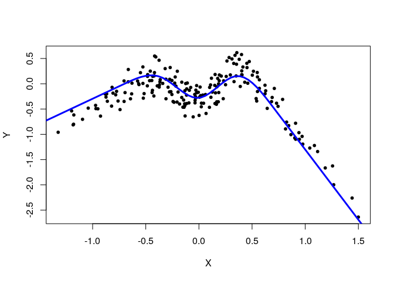
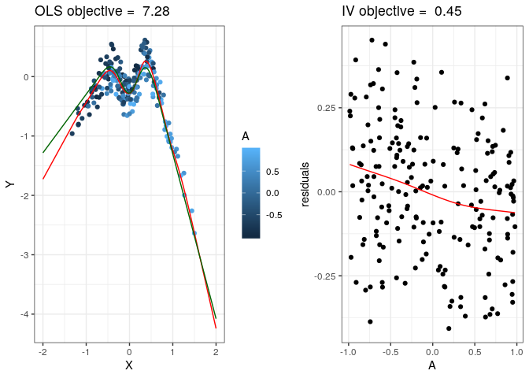

<!-- README.md is generated from README.Rmd. Please edit that file -->
NILE
====

<!-- badges: start -->
[](https://www.tidyverse.org/lifecycle/#maturing) <!-- badges: end -->

The goal of NILE is to ...

Installation
------------

<!-- You can install the released version of NILE from [CRAN](https://CRAN.R-project.org) with: -->
<!-- ``` r -->
<!-- install.packages("NILE") -->
<!-- ``` -->
You can install the the development version from [GitHub](https://github.com/) with:

``` r
# install.packages("devtools")
devtools::install_github("runesen/NILE")
```

Example
-------

This is a basic example which shows you how to solve a common problem:



    #> [1] "lambda.cv.a =  1.42932324587573"
    #> [1] "lambda.cv.x =  0.0015933292003293"
    #> [1] "lambda.nile.p.uncorr =  3.5873327255249"
